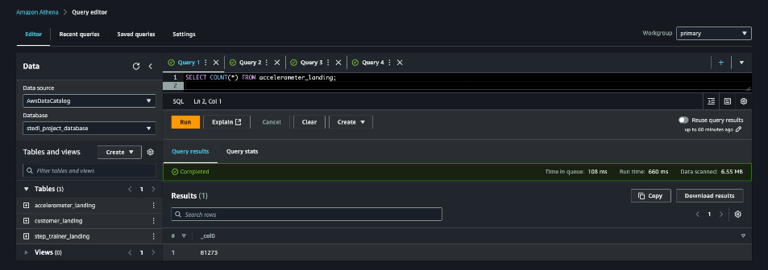
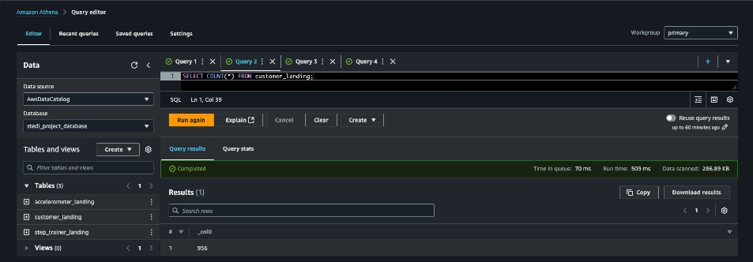
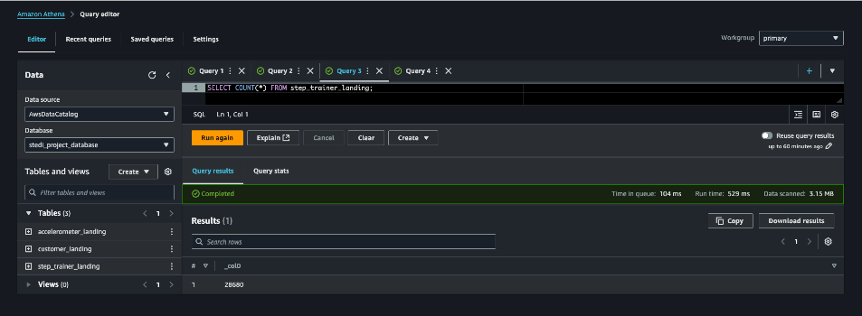

# Project 3: STEDI Human Balance Analytics

## Contents

+ [Problem Statement](#Problem-Statement)
+ [Project Discription](#Project-Discription)
+ [Project Datasets](#Project-Datasets)
+ [Implementation](#Implementation)

---
## Problem Statement

The STEDI Team has been hard at work developing a hardware STEDI Step Trainer that:
- trains the user to do a STEDI balance exercise
- has sensors on the device that collect data to train a machine-learning algorithm to detect steps
- has a companion mobile app that collects customer data and interacts with the device sensors

STEDI has heard from millions of early adopters who are willing to purchase the STEDI Step Trainers and use them.

Several customers have already received their Step Trainers, installed the mobile application, and begun using them together to test their balance. The Step Trainer is just a motion sensor that records the distance of the object detected. The app uses a mobile phone accelerometer to detect motion in the X, Y, and Z directions.

The STEDI team wants to use the motion sensor data to train a machine learning model to detect steps accurately in real-time. Privacy will be a primary consideration in deciding what data can be used.

Some of the early adopters have agreed to share their data for research purposes. Only these customers’ Step Trainer and accelerometer data should be used in the training data for the machine learning model.

---

## Project Discription

The STEDI Human Balance Analytics Project is designed to process, transform, and curate human balance data for machine learning applications. The data is collected from sensors and devices tracking users’ balance metrics, which is essential for developing predictive models to assess human balance and stability. By leveraging AWS services, the project automates data ingestion, transformation, and curation, producing a high-quality dataset that adheres to privacy regulations.

### Objectives

The primary goal of this project is to build a reliable and privacy-compliant pipeline that ingests raw sensor data, applies data cleaning and transformation steps, and prepares a refined dataset ready for machine learning. This dataset will ultimately enable the Data Science team to train models that can predict and analyze balance trends, which are crucial in fields like physical therapy, sports, and elderly care.

### Approach

1. **Data Ingestion:** Raw data from multiple sources, including customer information, accelerometer readings, and step trainer metrics, is ingested and stored in the landing zone on Amazon S3.
2. **Data Transformation and Filtering:** Each dataset undergoes a series of transformations to filter out unnecessary records, remove duplicates, and retain only the relevant information. This step also ensures that only data from users who consented to data sharing is retained.
3. **Data Integration and Curation:** Transformed datasets are joined and aggregated to create curated tables that combine sensor readings with customer-specific balance metrics. These curated tables are optimized for machine learning, with data aggregated by timestamp to facilitate time-series analysis.

### Project Value

This project not only delivers a curated dataset that meets the requirements for machine learning analysis but also establishes a scalable and privacy-compliant ETL pipeline. By ensuring that the dataset is anonymized and transformed to a high standard, this project provides a robust foundation for developing predictive models that can benefit health and wellness industries. The anonymized, machine-learning-ready data can assist researchers and practitioners in improving balance assessment and monitoring, contributing to better physical health outcomes for diverse user populations.

---

## Project Datasets

This project involves multiple datasets, each playing a critical role in building the final curated dataset for machine learning. The datasets are organized in three zones on Amazon S3: Landing Zone (raw data), Trusted Zone (filtered and transformed data), and Curated Zone (final aggregated data).

### 1. Landing Zone Datasets

The Landing Zone contains the raw data ingested from various sources. Each dataset is stored in its original format and serves as the source for transformations applied in subsequent zones.

#### Customer Data:
- **Description:** Contains personal details of customers, such as name, email, and consent status for data sharing.
- **Format:** JSON
- **Path:** s3://stedi-human-balance-analytics-project/landing_zone/customer/

#### Accelerometer Data:
- **Description:** Provides time-series sensor readings from accelerometers, capturing balance and movement data for each customer.
- **Format:** JSON
- **Path:** s3://stedi-human-balance-analytics-project/landing_zone/accelerometer/

#### Step Trainer Data:
- **Description:** Contains step count and related metrics captured by step trainers, associated with customer serial numbers.
- **Format:** JSON
- **Path:** s3://stedi-human-balance-analytics-project/landing_zone/step_trainer/

### 2. Trusted Zone Datasets

The Trusted Zone includes data that has undergone filtering and transformation to ensure only relevant and consented records are included. This zone prepares the data for integration.

#### Customer Trusted:
- **Description:** Filtered dataset containing only customers who consented to data sharing, with duplicates removed.
- **Transformations:** Filtering based on consent, deduplication on serial numbers.
- **Format:** Parquet
- **Path:** s3://stedi-human-balance-analytics-project/trusted_zone/customer_trusted/

#### Accelerometer Trusted:
- **Description:** Processed accelerometer data associated only with consented customers, ensuring privacy compliance.
- **Transformations:** Filtering based on customer consent.
- **Format:** Parquet
- **Path:** s3://stedi-human-balance-analytics-project/trusted_zone/accelerometer_trusted/

#### Step Trainer Trusted:
- **Description:** Cleaned step trainer data linked to unique customer records, filtered to remove irrelevant entries.
- **Transformations:** Filtering based on customer consent, deduplication on serial numbers.
- **Format:** Parquet
- **Path:** s3://stedi-human-balance-analytics-project/trusted_zone/step_trainer_trusted/

### 3. Curated Zone Datasets

The Curated Zone contains the final datasets that combine various sources and are optimized for machine learning.

#### Customer Curated:
- **Description:** Final dataset of customer records, anonymized and free of PII, ready for machine learning use.
- **Transformations:** Joined with other data sources (e.g., accelerometer data)
- **Format:** Parquet
- **Path:** s3://stedi-human-balance-analytics-project/curated_zone/customer_curated/

#### Machine Learning Curated:
- **Description:** The comprehensive dataset that integrates step trainer and accelerometer readings, anonymized for GDPR compliance. This dataset is designed to enable predictive modeling and time-series analysis for balance assessment.
- **Transformations:** Joined on timestamp to combine step trainer and accelerometer readings, and aggregation based on timestamps.
- **Format:** Parquet
- **Path:** s3://stedi-human-balance-analytics-project/curated_zone/customer_curated/

---

## Implementation

1. Data Ingestion

### Description:

Data ingestion involves loading the raw data from S3 into AWS Glue. Each dataset (customer, accelerometer, and step trainer) is loaded into the Landing Zone and prepared for transformation.

### Steps:

1. Created Glue jobs to load data from S3 into the Landing Zone.
2. Verified row counts to ensure data was successfully ingested.

### Results:

These Athena queries confirm row counts for the raw datasets:

* ***Accelerometer Landing Table Count:*** 81,273 rows

* ***Customer Landing Table Count:*** 956 rows

* ***Step Trainer Landing Table Count:*** 28,680 rows

2. Transformation and Trusted Zone Creation

> In the Trusted Zone, I created AWS Glue jobs to make transofrmations on the raw data in the landing zones.

**Glue job scripts**

[1. customer_landing_to_trusted.py](customer_landing_to_trusted.py) - This script transfers customer data from the 'landing' to 'trusted' zones. It filters for customers who have agreed to share data with researchers.

[2. accelerometer_landing_to_trusted_zone.py](accelerometer_landing_to_trusted_zone.py) - This script transfers accelerometer data from the 'landing' to 'trusted' zones. Using a join on customer_trusted and accelerometer_landing, It filters for Accelerometer readings from customers who have agreed to share data with researchers.

[3. Trainer_landing_to_trusted.py](Trainer_landing_to_trusted.py) - This script transfers Step Trainer data from the 'landing' to 'trusted' zones. Using a join on customer_curated and step_trainer_landing, It filters for customers who have accelerometer data and have agreed to share their data for research with Step Trainer readings.

The customer_trusted table was queried in Athena to show that it only contains customer records from people who agreed to share their data.

3. Joining and Curated Zone Creation

> In the Curated Zone I created AWS Glue jobs to make further transformations, to meet the specific needs of a particular analysis.

**Glue job scripts**

[customer_trusted_to_curated.py](customer_trusted_to_curated.py) - This script transfers customer data from the 'trusted' to 'curated' zones. Using a join on customer_trusted and accelerometer_landing, It filters for customers with Accelerometer readings and have agreed to share data with researchers.

[Trainer_trusted_to_curated.py](Trainer_trusted_to_curated.py): This script is used to build aggregated table that has each of the Step Trainer Readings, and the associated accelerometer reading data for the same timestamp, but only for customers who have agreed to share their data.

4. Final Validation and Verification

> In the Curated Zone I created AWS Glue jobs to make further transformations, to meet the specific needs of a particular analysis.

**Glue job scripts**

[customer_trusted_to_curated.py](customer_trusted_to_curated.py) - This script transfers customer data from the 'trusted' to 'curated' zones. Using a join on customer_trusted and accelerometer_landing, It filters for customers with Accelerometer readings and have agreed to share data with researchers.

[Trainer_trusted_to_curated.py](Trainer_trusted_to_curated.py): This script is used to build aggregated table that has each of the Step Trainer Readings, and the associated accelerometer reading data for the same timestamp, but only for customers who have agreed to share their data.

